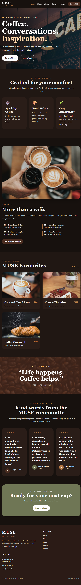
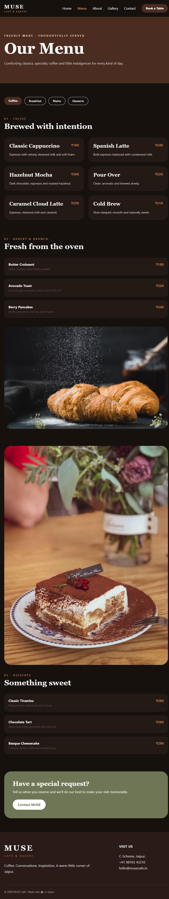
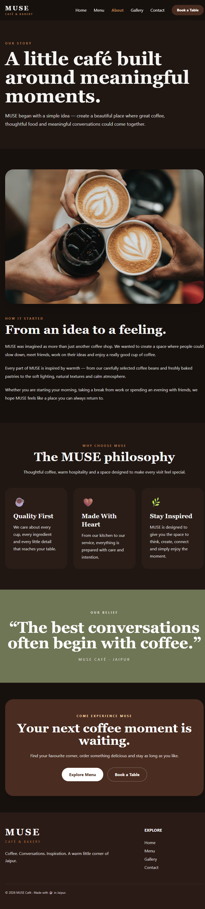
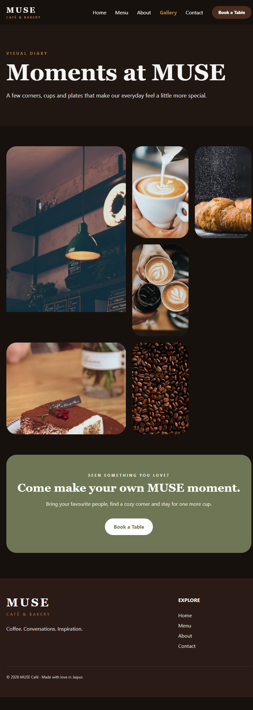
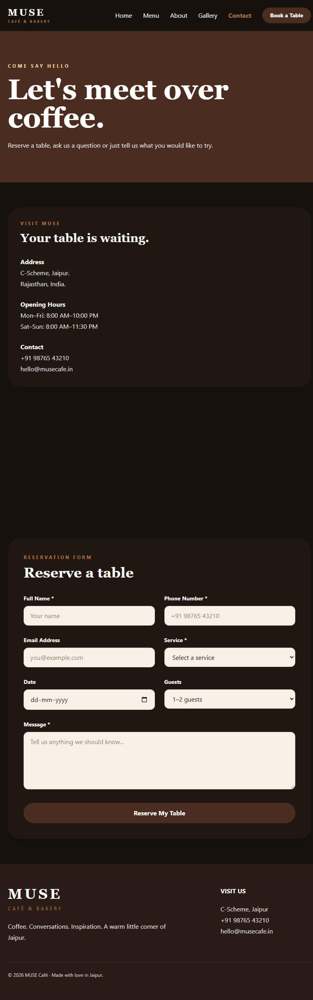

# MUSE Café & Bakery

MUSE Café is a modern, responsive café website designed with a warm, cozy and premium aesthetic.

## Pages
- Home
- Menu
- About
- Gallery
- Contact

## Technologies Used
- HTML5
- Tailwind CSS
- Git & GitHub

## Project Features
- Responsive design
- Café menu sections
- Gallery
- About section
- Contact section
- Modern café-inspired UI

## Live Link

[Visit MUSE Café Website](PASTE-YOUR-LIVE-LINK-HERE)

## Screenshots

### Home Page

### Menu Page

### About Page

### Gallery Page

### Contact Page

## Live Link

[Visit MUSE Café Website](https://nazarchoudhary.github.io/MUSE-Cafe-Website/)